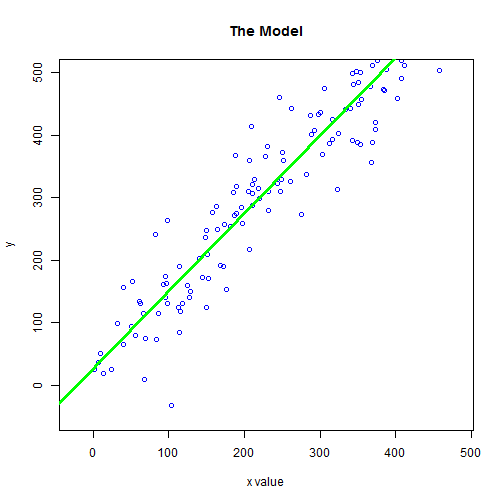

## A Tool to explore linear models

* Students can easily play with the data parameters
* App provides insight through immediate visualization
* Linear model and fit estimate (R-squared) feedback
* Intuitive understanding of linear model

--- .class #id 

## The model concept

A linear model based on some pseudo-random data, generated in R

--- .class #id 

## Generating linear data with some random error

Generating linear data.

      y = a + b * x + e

y - a linear transformation of the x data with some random error added   
a - is the intercept   
b - is the slope   
x - uniformly distributed random data   
e - is normally distributed with standard deviation set by the user.  

Note that student can change a, b, and e dynamically using sliders.

A linear model is fitted to the generated data and plotted over the generated points.
The R-squared value for the model is displayed to the user.

--- .class #id 

## ShinyApp Easy App

* Enables students to dynamically visualize a linear model
* App implements the functionality in reactive manner
* No coding required from students
* Easily deployable to 'cloud'
* Easy application and user management

Thanks for your attention

